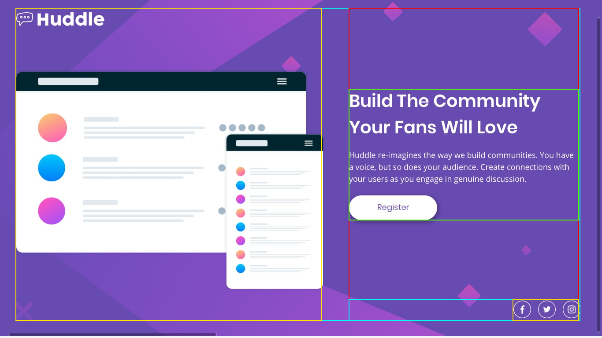
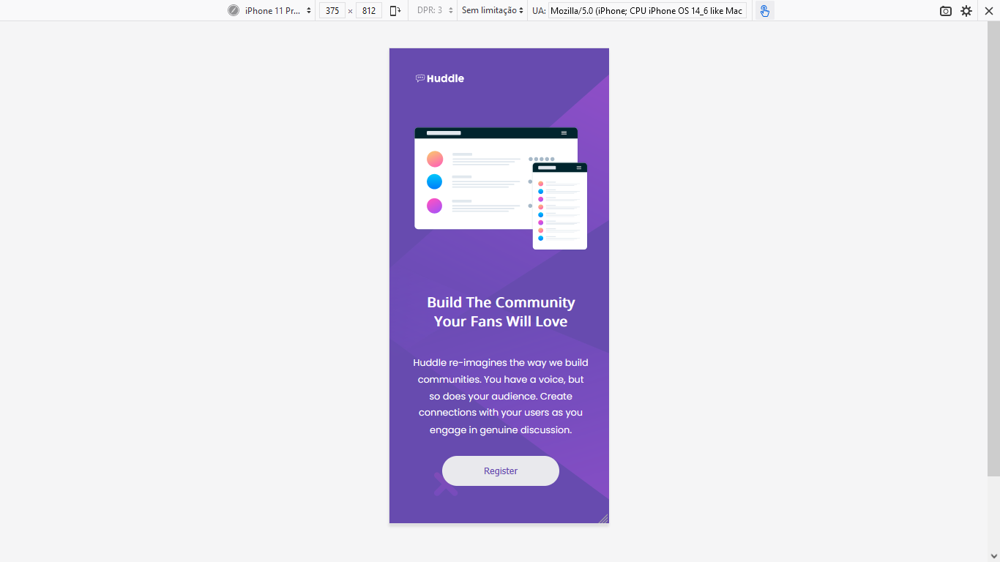

<h1>HUnddle Frontend MEntor</h1>
 

Desafio realizado para Frontend Mentor com HTML e CSS.

 
<h2> Separando em Box Model a imagem JPG. </h2>
 

 
<h2>Layout Desktop </h2>
 

 
<h2>Layout Desktop Hover Botão </h2>
 

 
<h2>Layout Desktop Hover Ícones</h2>
 

 
<h2>Layout Mobile</h2>
 

 
<h3>Sobre o desafio</h3>
 

Desafio sem muitas dificuldades. NEWBIE TOTAL.
